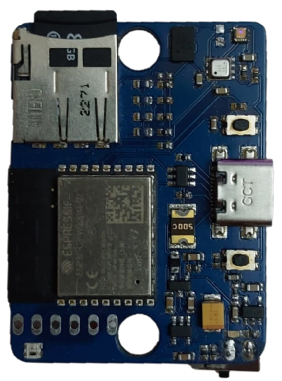

# ESP32 Motion Tracking using WebServer

## Implementare curenta

Implementarea curenta ->[ESP32 Motion Tracking](https://github.com/FarhadGUL06/esp32_motion_tracking.git).

## Descriere

Acest repository contine **setupul vechi** pentru colectare de date cu senzori. Fiecare senzor este plasat pe o anumita zona a corpului, urmand ca acestia sa inregistreze mersul.

## Hardware folosit

Pe langa alte functionalitati, aceasta placuta dispune de un cititor de carduri microSD pe care se salveaza datele si de un accelerometru + giroscop care inregistreaza datele.

## Setup

Fiecare senzor expune un server web cu care poate interactiona clientul. Din cauza consumului ridicat, am renuntat la aceasta implementare.